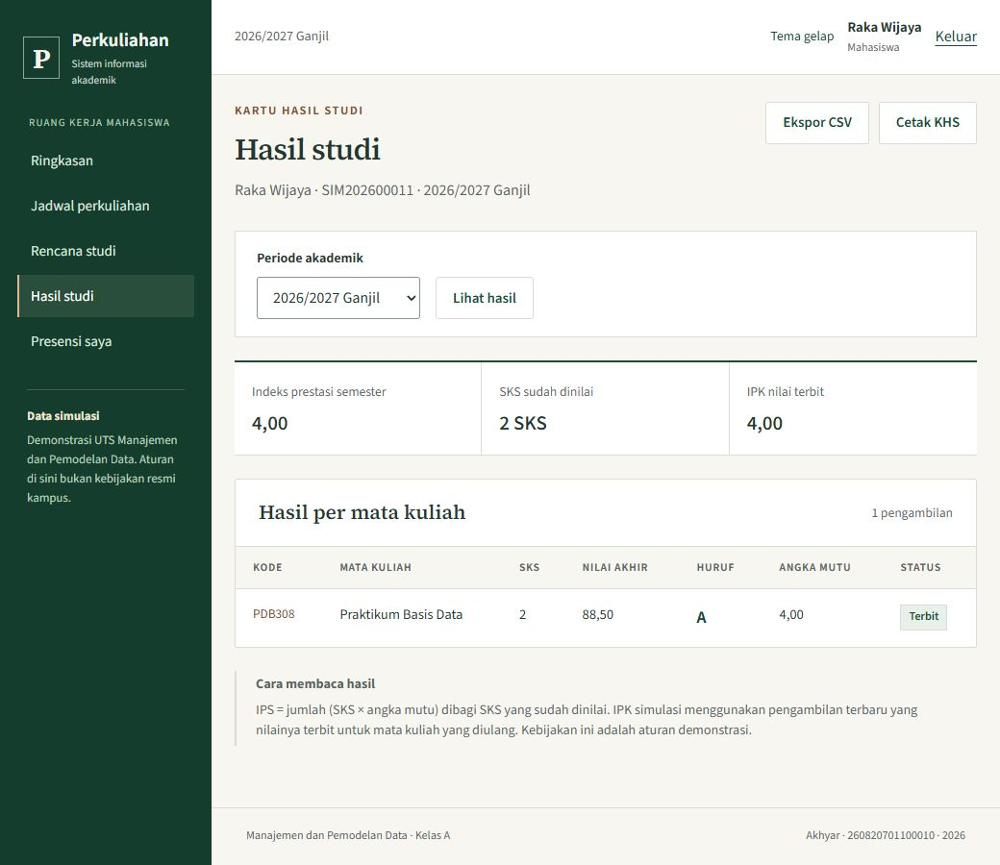

# Sistem Informasi Perkuliahan

**UTS Manajemen dan Pemodelan Data** · Akhyar · NPM 260820701100010 · Kelas A

Aplikasi Laravel 13, PHP 8.5, dan MySQL 8.0 untuk mengelola perkuliahan dari penyusunan KRS sampai penerbitan KHS. Admin menyiapkan data akademik dan menyetujui KRS, dosen mencatat presensi serta nilai, dan mahasiswa mengikuti perkembangan studinya.

Seluruh profil peserta, nilai, jadwal, dan aturan akademik merupakan **data simulasi**. Identitas penyusun digunakan pada satu profil demonstrasi.



Tangkapan layar asli dari pengujian paket hasil ekstraksi. Mahasiswa simulasi Raka Wijaya mengambil PDB308, mendapat presensi Hadir, lalu menerima nilai terbit 88,50/A dengan IPS 4,00.

## Alur dan peran

| Peran | Pekerjaan |
|---|---|
| Admin | CRUD pengguna dan data akademik, kelas dan jadwal, persetujuan KRS, aturan SKS, skala nilai, rekap, serta riwayat perubahan |
| Dosen | Kelas yang diampu, pertemuan, presensi, komponen nilai, publikasi nilai, koreksi dengan alasan, dan rekap peserta |
| Mahasiswa | KRS, status persetujuan, jadwal, presensi pribadi, KHS, IPS, dan IPK |

Pencarian, filter, pagination, ekspor CSV, halaman cetak KRS/KHS/jadwal, serta tema terang dan gelap tersedia dalam aplikasi. Font Source Sans 3 dan Source Serif 4 dilayani secara lokal; lisensinya ada di [Aplikasi/public/licenses](Aplikasi/public/licenses).

KRS diajukan memesan kapasitas kelas, sedangkan pengembalian melepasnya. Pengajuan memeriksa periode, prodi, batas SKS, mata kuliah ganda, benturan jadwal, dan kursi. Transaksi dan penguncian kelas melindungi pengajuan bersamaan.

Nilai kosong berarti belum dinilai. Publikasi memerlukan nilai lengkap seluruh peserta aktif. Bobot terkunci sejak publikasi pertama; koreksi nilai terbit memerlukan alasan dan menyimpan nilai sebelum serta sesudah perubahan. IPS dihitung dari nilai terbit berbobot SKS; IPK simulasi memakai pengambilan terbaru yang telah terbit ketika mata kuliah diulang.

## Mengambil kode dari GitHub

```powershell
git clone https://github.com/Akhyarrrrr/UTS-Sistem-Informasi-Perkuliahan.git
Set-Location UTS-Sistem-Informasi-Perkuliahan
```

## Instalasi pertama di Windows

1. Gunakan folder hasil clone yang dapat ditulis. Pertahankan susunan `Aplikasi`, `SQL`, `Bukti`, dan skrip pada tingkat yang sama.
2. Sediakan PHP 8.5 dengan PDO MySQL, mbstring, tokenizer, openssl, fileinfo, XML, dan zip; Composer 2; Node.js 22.12+ atau 24; serta MySQL 8.0. Port 8088 dan 3319 harus tersedia. Aplikasi telah diuji pada PHP 8.5.0, Node 24.18.0, dan MySQL 8.0.46.
3. Buka PowerShell di folder `UTS-Sistem-Informasi-Perkuliahan`, yaitu folder repo yang memuat `install.ps1`:

```powershell
powershell -ExecutionPolicy Bypass -File .\check.ps1
powershell -ExecutionPolicy Bypass -File .\install.ps1
powershell -ExecutionPolicy Bypass -File .\start.ps1
```

Jika lokasi MySQL berbeda:

```powershell
powershell -ExecutionPolicy Bypass -File .\install.ps1 -MySqlBin 'D:\tools\mysql\bin'
powershell -ExecutionPolicy Bypass -File .\start.ps1 -MySqlBin 'D:\tools\mysql\bin'
```

Instalasi memasang dependensi dari `composer.lock` dan `package-lock.json`, membuat instans MySQL khusus, mengatur `.env`, menjalankan migration/seeder, lalu membangun aset. Internet diperlukan untuk mengunduh dependensi pada instalasi pertama. Font dan aset aplikasi dilayani secara lokal setelah build. Tidak diperlukan Docker. Dua salinan aplikasi tidak dapat memakai port 8088 dan 3319 secara bersamaan; skrip memeriksa pemilik port sebelum memakai atau menghentikan layanan.

Buka **http://localhost:8088**. Akun dan kata sandi demo yang dibuat instalasi berada dalam `Runtime/akses-demo.txt`. Tiga akun utama: `admin@demo.test`, `dosen@demo.test`, dan `mahasiswa@demo.test`; semua akun simulasi memakai kata sandi instalasi yang sama. Akun Raka Wijaya untuk hasil demonstrasi: `mhs11@demo.test`. Kata sandi lokal tidak disertakan dalam repo.

Skrip tidak menggunakan MySQL utama komputer. Data berada di `Runtime/mysql-data`, pada port 3319 dengan koneksi loopback. Aplikasi memakai `uts_perkuliahan`; tes memakai `uts_perkuliahan_test`. Jangan memindahkan atau menghapus Runtime saat layanan masih berjalan.

## Menjalankan berikutnya

```powershell
powershell -ExecutionPolicy Bypass -File .\start.ps1
powershell -ExecutionPolicy Bypass -File .\stop.ps1
```

`stop.ps1` menghentikan layanan dan mempertahankan data. Jangan menjalankan `migrate:fresh` pada database aplikasi yang ingin dipertahankan. Seeder hanya membuat data awal ketika belum ada fakultas; pengulangan instalasi tidak mengganti catatan yang sudah ada.

## Demo yang tersedia

- Admin: persetujuan KRS Nadia Rahma; CRUD master; aturan SKS dan skala; rekap dan riwayat.
- Dosen utama: MPD301 A/B, PSD304 A, serta PDB308 A. PSD304 mempunyai nilai yang belum lengkap untuk demonstrasi validasi.
- Akhyar: KRS 11 SKS, 8 SKS bernilai terbit, IPS sementara 3,75, IPK 3,55. Satu nilai belum terbit.
- Raka Wijaya: PDB308, presensi Hadir, nilai 88,50/A, IPS 4,00. `DemonstrationSeeder` mereproduksi hasil akhir demonstrasi browser; audit menyebut sumber seeder secara jelas.
- `mhs12@demo.test`: belum memiliki KRS dan dapat dipakai untuk mencoba alur baru. Mata kuliah dengan nilai terbit tidak menerima peserta baru. Gunakan kelas B atau kelas lain yang belum terbit.

Admin membuat/meninjau kelas, mahasiswa menyimpan dan mengajukan KRS, admin menyetujui atau mengembalikan dengan alasan, dosen mencatat pertemuan/presensi dan nilai, lalu menerbitkan nilai. Nilai kosong berarti belum dinilai. Koreksi hasil terbit membutuhkan alasan; bobot tetap dikunci setelah terbit pertama.

## Pengujian

Pemeriksaan aplikasi pada **4 Oktober 2026** menghasilkan **32 tes lulus dengan 248 assertion**. Dua proses PHP yang memperebutkan satu kursi terakhir menghasilkan satu pengajuan diterima dan satu ditolak. Import snapshot SQL menghasilkan 18 tabel, 6 trigger, 23 FK, dan tanpa baris yatim. Rincian hasil dan metode terdapat pada [Bukti/README.md](Bukti/README.md); file bukti mempertahankan tanggal pengujian aslinya.

```powershell
cd Aplikasi
php artisan test --compact --log-junit ../Bukti/phpunit.xml
php scripts/test-concurrency.php
npm run build
php scripts/export-evidence.php
```

Tes Laravel mempunyai guard nama database khusus. Skrip konkurensi **membuat ulang hanya `uts_perkuliahan_test`**, lalu menjalankan dua proses PHP untuk kursi terakhir. Jangan menjalankan tes Laravel dan skrip konkurensi bersamaan karena keduanya memakai database tes yang sama.

## Snapshot SQL dan pemulihan

- `SQL/struktur.sql`: struktur aktual, indeks, FK, CHECK, dan trigger.
- `SQL/data-simulasi.sql`: snapshot akhir demonstrasi. Kata sandi/remember token asli tidak diekspor; akun dikunci sampai diaktifkan secara lokal.
- `SQL/query-pembuktian.sql`: JOIN, agregasi SKS, pemeriksaan baris yatim, serta UPDATE/DELETE transaksi.
- `Bukti/database.json`: tipe kolom, jumlah baris, query, keluaran SQL, IPS/IPK, dan waktu snapshot.

Jalur utama instalasi adalah migration + seeder. Untuk memulihkan snapshot pada **database kosong UTS**, jalankan konfigurasi lokal, lalu `php artisan migrate --force` tanpa `--seed`. Setelah semua tabel kosong dibuat, impor **hanya `data-simulasi.sql`** memakai klien MySQL yang mengarah ke port 3319. Jangan mengimpor `struktur.sql` di atas tabel yang sudah dibuat migration. Selanjutnya jalankan:

```powershell
php scripts/activate-demo.php
```

File struktur disediakan untuk penilaian DDL dan pembuatan tabel akademik pada database kosong tanpa migration. Jika memilih jalur DDL mandiri, tabel infrastruktur Laravel (sessions/cache/locks) juga perlu dibuat dari migration bawaan sebelum aplikasi dijalankan.

## Hosting

Sesuaikan `APP_URL`, `APP_KEY`, koneksi MySQL, dan cookie HTTPS; pertahankan kunci aplikasi selama data terenkripsi/sesi masih digunakan. Jalankan build dan migration pada lingkungan target. MySQL produksi harus eksternal jika aplikasi berjalan sebagai fungsi Vercel. PHP tersedia lewat runtime komunitas; Laravel membutuhkan adapter/runtime yang diuji tersendiri. Rujukan: [Vercel runtimes](https://vercel.com/docs/functions/runtimes), [Laravel deployment](https://laravel.com/docs/13.x/deployment). Deployment publik belum dilakukan.

## Susunan repo

| Folder / berkas | Isi |
|---|---|
| [Aplikasi](Aplikasi) | Kode Laravel, migration, seeder, tes, font, dan aset hasil build |
| [SQL](SQL) | Struktur, snapshot data simulasi, dan query pembuktian |
| [Bukti](Bukti/README.md) | Hasil pengujian aplikasi dan screenshot asli |
| [install.ps1](install.ps1) | Pemasangan dan konfigurasi pertama |
| [start.ps1](start.ps1), [stop.ps1](stop.ps1) | Menjalankan dan menghentikan layanan tanpa menghapus data |
| [check.ps1](check.ps1) | Memeriksa prasyarat dan port |
| [DESIGN.md](DESIGN.md) | Arahan visual antarmuka |

Environment, Runtime, database biner, cache, log, `vendor`, dan `node_modules` dikecualikan dari Git. Font beserta lisensi dan aset Vite hasil build disertakan. Paket laporan PDF dan sumber LaTeX disimpan terpisah dari repo aplikasi.
